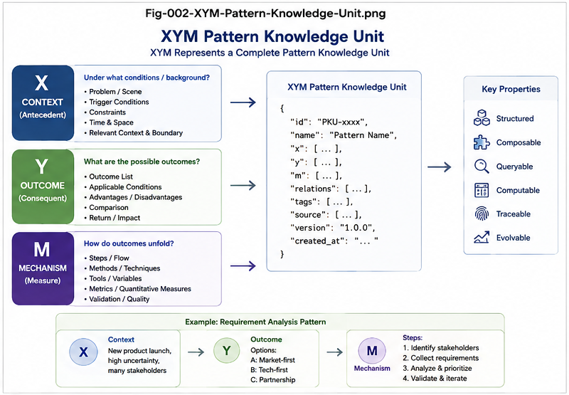
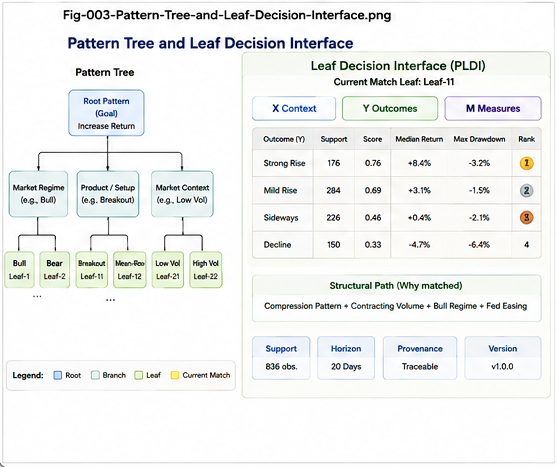
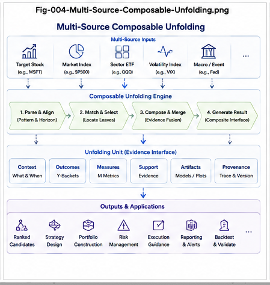
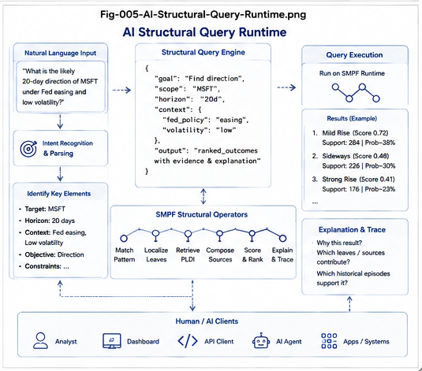

# Stock-Market Structural Folding (SMSF)

> **Fold historical market experience into navigable structural evidence.  
> Unfold relevant possibilities for online decision support.**

**Stock-Market Structural Folding (SMSF)** is a structural decision architecture for transforming historical market data into reusable, queryable, and composable market experience.

Instead of asking a model to repeatedly infer everything from raw historical data, SMSF performs the expensive structural work offline:

\[
\text{Historical Data}
\rightarrow
\text{Pattern Discovery}
\rightarrow
(X,Y,M)
\rightarrow
\text{Pattern Differential Tree}
\rightarrow
\text{PLDI}
\]

At runtime, a current market state is localized into the folded structure and relevant historical possibility spaces are unfolded:

\[
\text{Current State}
\rightarrow
\text{Leaf Localization}
\rightarrow
\text{PLDI Retrieval}
\rightarrow
\text{Composition}
\rightarrow
\text{Policy}
\rightarrow
\text{Decision}
\]

The central runtime principle is:

\[
\boxed{\text{Heavy Fold, Light Unfold}}
\]

---

<p align="center">
  
</p>

---

## 1. Why SMSF?

Historical market data are abundant.

Historical market **structure** is not.

A conventional dataset may contain:

- price;
- volume;
- volatility;
- events;
- macroeconomic context;
- index behavior;
- sector behavior;
- cross-asset information.

But these observations normally remain organized primarily by:

\[
\text{Ticker} \times \text{Time}
\]

SMSF asks a different question:

> **Can historical market experience be folded into structural knowledge that can later be localized, queried, composed, and unfolded?**

The architecture transforms:

```text
Raw Historical Data
        ↓
Historical Episodes
        ↓
Structural Differences
        ↓
Pattern Differential Tree
        ↓
Localized Historical Evidence
        ↓
Decision Interfaces
````

The result is not merely another predictor.

It is a **structural experience substrate** for prediction, comparison, decision support, AI querying, and policy-aware runtime use.

---

## 2. The Core Unit: X–Y–M

SMSF represents a discovered historical episode as:

$$
P_i=(X_i,Y_i,M_i)
$$

where:

### X — Antecedent Structure

What was structurally present before the outcome?

Examples:

* price trajectory;
* volume trajectory;
* volatility state;
* market regime;
* event sequence;
* macro context;
* cross-asset context.

### Y — Consequent Outcome

What happened afterward?

Examples:

* strong rise;
* mild rise;
* sideways;
* decline;
* breakout;
* reversal;
* trajectory class.

### M — Measures

How did the outcome occur?

Examples:

* return;
* drawdown;
* volatility;
* duration;
* recovery time;
* tail loss.

This creates a reusable historical knowledge unit:

$$
\boxed{X \rightarrow (Y,M)}
$$

Pattern discovery and Pattern IR are intentionally extensible and may be supplied by user plugins.

---

## 3. SMSF Grand Map

<p align="center">
  
</p>

The complete architecture has two major phases.

### Offline — Structural Folding

```text
Historical Market Data
        ↓
Pattern Discovery
        ↓
Pattern IR
        ↓
X–Y–M Episodes
        ↓
Pattern Differential Tree
        ↓
Pattern Leaves
        ↓
Leaf CCC
        ↓
Two-Way CCC
        ↓
Pattern Leaf Decision Interfaces
```

### Online — Structural Unfolding

```text
Current Market State
        ↓
Current Pattern IR
        ↓
Leaf Localization
        ↓
Relevant PLDIs
        ↓
Multi-Source Composition
        ↓
Scoring
        ↓
On-the-Fly Policy Unfolding
        ↓
Decision / Explanation
```

---

## 4. Pattern Knowledge Unit

<p align="center">
  
</p>

The first folding step converts historical observations into structurally meaningful episodes.

Instead of preserving only:

```text
timestamp → values
```

SMSF attempts to preserve:

```text
antecedent structure
        ↓
subsequent outcome
        ↓
quantitative consequence
```

or:

$$
X\rightarrow Y,M
$$

This distinction is fundamental.

SMSF is not primarily trying to compress historical values.

It is trying to fold **historical experience**.

---

## 5. Pattern Differential Tree

The Pattern Differential Tree organizes the \(X\)-side of historical episodes.

Given:

$$
\{X_1,X_2,\ldots,X_N\}
$$

SMSF constructs:

$$
\{X_1,X_2,\ldots,X_N\}
\xrightarrow{\text{Differential Folding}}
T_X
$$

The tree asks:

> **Along which meaningful structural dimensions do these historical patterns differ?**

Possible differential dimensions include:

* trajectory;
* price structure;
* volume structure;
* volatility;
* market regime;
* macro context;
* value-based events;
* cross-asset state;
* user-defined Pattern IR dimensions.

This creates a navigable topology of historical experience.

---

## 6. Context and Value-Based Events Are Structural Coordinates

A major benefit of the Differential Tree is that important context does not have to disappear inside a large opaque feature vector.

For example:

```text
Price Compression
        ↓
Volume Contraction
        ↓
Market Regime
   ├── Bull
   ├── Sideways
   └── Bear
```

Likewise, value-based events can become explicit differential dimensions:

```text
Fed Policy
   ├── Tightening
   ├── Unchanged
   └── Easing
```

This makes historically difficult questions structurally queryable:

> How did the same local pattern behave under different Fed regimes?

An event may either be part of \(X\) or become an explicit Differential Tree layer, depending on the research objective.

---

## 7. From Pattern Tree to Decision Interface

<p align="center">
  
</p>

A Pattern Leaf represents a localized historical structural population.

The tree answers:

> **Where should we look?**

The leaf's RHS evidence then answers:

> **What happened historically in this structural region?**

For a leaf:

$$
L_j=
\{
(X_1,Y_1,M_1),
\ldots,
(X_n,Y_n,M_n)
\}
$$

SMSF analyzes the RHS population using Two-Way CCC and constructs a:

$$
\boxed{
PLDI =
Pattern\ Leaf\ Decision\ Interface
}
$$

A conceptual PLDI exposes:

```text
Outcome Y1
    Structural Score
    Measures
    Support
    Evidence
    Provenance

Outcome Y2
    Structural Score
    Measures
    Support
    Evidence
    Provenance

...
```

---

## 8. Preserve Possibilities Before Choosing a Winner

Suppose historical evidence produces:

```text
Strong Rise      22%
Mild Rise        34%
Sideways         26%
Decline          18%
```

SMSF does not immediately reduce this to:

```text
Prediction = Mild Rise
```

Instead, it preserves the possibility structure.

Formally:

$$
PLDI=
\{B_1,B_2,\ldots,B_K\}
$$

rather than:

$$
PLDI=\arg\max_i B_i
$$

This establishes an important principle:

$$
\boxed{
\text{Fold evidence without prematurely destroying alternatives.}
}
$$

Policy can be applied later.

---

## 9. Local Models as Companions

A sufficiently populated Pattern Leaf may optionally train a local model such as:

* Logistic Regression;
* small MLP;
* Gradient Boosting;
* Bayesian model;
* another local classifier.

The architecture becomes:

```text
Current Pattern
      ↓
Structural Localization
      ↓
Pattern Leaf
   ↙        ↘
 PLDI      Local Model
   ↓          ↓
Historical   Statistical
Evidence     Estimate
```

The model does not replace the structural evidence.

It provides a second view.

This gives:

$$
\boxed{
Structural\ Localization
+
Local\ Approximation
}
$$

instead of requiring one global model to approximate every market regime simultaneously.

---

## 10. Multi-Source Composable Unfolding

<p align="center">
  
</p>

A real market decision may involve many sources:

```text
MSFT
SP500
QQQ
VIX
Treasury Rates
Fed Events
Sector Context
...
```

SMSF does not require all of these to be concatenated into one raw feature vector.

Each source may first perform its own folding:

$$
Source_i
\rightarrow
Tree_i
\rightarrow
PLDI_i
$$

Then:

$$
PLDI_1+PLDI_2+\cdots+PLDI_n
\rightarrow
CompositeEvidence
$$

This produces another core SMSF principle:

$$
\boxed{
\text{Scale by interface composition, not by raw-feature concatenation.}
}
$$

---

## 11. Evidence Is Not Policy

SMSF separates three fundamentally different objects:

### Market Context

What is happening in the world?

### User Preference

What does the user care about?

### Decision Policy

How should evidence and preference be mapped into an action?

Therefore:

$$
\boxed{
MarketContext
\neq
UserPreference
\neq
DecisionPolicy
}
$$

The canonical historical tree should normally fold market evidence, not one user's preferences.

This allows the same historical fold to support many users and many policies.

---

## 12. On-the-Fly Policy Unfolding

Once the current pattern has been localized, relevant evidence is already concentrated near a small number of Pattern Leaves.

Let:

$$
E_L
$$

be localized evidence,

$$
P_u
$$

be user preference, and

$$
S
$$

be current portfolio state.

Then:

$$
PolicySpace
=
g(E_L,P_u,S)
$$

can often be generated dynamically.

For example:

```text
PLDI
    ↓
User Preference
    ↓
Portfolio State
    ↓
On-the-Fly Policy Space
    ↓
Candidate Actions
```

This avoids precomputing every possible user-policy combination.

Hence:

$$
\boxed{
Heavy\ Fold,\ Light\ Unfold
}
$$

---

## 13. AI Structural Query Runtime

<p align="center">
  
</p>

SMSF also creates an unusual opportunity for AI.

Instead of asking an AI to repeatedly reason over raw rows, the AI can operate over explicit structural objects:

```text
Pattern
Tree
Branch
Leaf
CCC
PLDI
Outcome
Measure
Context
Event
Score
Policy
Provenance
```

This makes SMSF naturally compatible with structured AI APIs.

---

## 14. From SQL to Structural Query

Traditional SQL asks questions such as:

```sql
SELECT *
FROM market_data
WHERE ticker = 'MSFT';
```

An SMSF runtime can support higher-order questions:

```text
MATCH PATTERN current_msft

LOCALIZE IN smsf_tree

UNFOLD OUTCOME
FOR horizon = 20d

UNDER CONTEXT
    fed = easing
    market_regime = bullish

MERGE
    qqq_context,
    vix_context

APPLY POLICY
    conservative_20d

RETURN
    outcome,
    score,
    support,
    drawdown,
    provenance;
```

The syntax is illustrative.

The important transition is:

$$
Query\rightarrow RawRows
$$

becoming:

$$
\boxed{
Query\rightarrow FoldedStructuralExperience
}
$$

---

## 15. Three API Layers

A future SMSF runtime can expose three API levels.

### Data API

```text
GET_PRICES
GET_VOLUME
GET_EVENTS
GET_CONTEXT
```

### Structural API

```text
MATCH_PATTERN
STRUCTURAL_SIMILARITY
LOCALIZE_LEAF
GET_PLDI
COMPARE_CONTEXT
TRACE_PROVENANCE
```

### Decision API

```text
UNFOLD_OUTCOMES
MERGE_INTERFACES
SCORE_CANDIDATES
APPLY_POLICY
COMPARE_POLICIES
EXPLAIN_DECISION
```

The Structural and Decision APIs expose folded intelligence directly to AI agents and applications.

---

## 16. Explanation by Execution Trace

SMSF does not require explanation to be invented after the decision.

The computational path itself is explanatory:

```text
Current Pattern
      ↓
Differential Path
      ↓
Pattern Leaf
      ↓
PLDI
      ↓
Multi-Source Composition
      ↓
Scoring
      ↓
Policy
      ↓
Decision
```

The system can trace:

$$
Decision
\rightarrow
Policy
\rightarrow
CompositeEvidence
\rightarrow
PLDI
\rightarrow
Leaf
\rightarrow
HistoricalEpisodes
$$

This is:

$$
\boxed{
Explanation\ by\ Execution\ Trace
}
$$

---

## 17. Structural Gap Detection

SMSF should not force every new market condition into existing history.

Possible gap signals include:

```text
No Matching Leaf
Low Structural Similarity
Low Support
Context Mismatch
Cross-Source Conflict
Local-Model Disagreement
New Event Type
```

The runtime may explicitly return:

$$
GAP
$$

and preserve the observation for later analysis.

This creates a natural learning cycle:

$$
Fold
\rightarrow
Unfold
\rightarrow
Observe
\rightarrow
Compare
\rightarrow
Gap
\rightarrow
Refold
$$

---

# 18. Four Core Articles

The repository is intentionally centered on a small set of core documents.

### SMPF-001 — From Historical Market Data to Folded Structural Experience

Defines the basic problem, X–Y–M historical episodes, Pattern IR, and structural folding objective.

### SMPF-002 — Pattern Differential Tree

Develops the structural organization of historical \(X\)-patterns through Differential Trees, metrics, context, events, and leaf localization.

### SMPF-003 — From Pattern Leaves to Decision Interfaces

Introduces Two-Way CCC, RHS outcome organization, PLDI, uncertainty preservation, provenance, and local companion models.

### SMPF-004 — Composable Unfolding

Develops multi-source composition, scoring, on-the-fly Policy Space, AI agents, and SQL-like structural runtime APIs.

Recommended reading order:

$$
\boxed{
001\rightarrow002\rightarrow003\rightarrow004
}
$$

or conceptually:

$$
\boxed{
What\ to\ Fold
\rightarrow
How\ to\ Organize
\rightarrow
How\ to\ Expose
\rightarrow
How\ to\ Unfold
}
$$

---

# 19. Figures

| Figure                                                 | Purpose                                              |
| ------------------------------------------------------ | ---------------------------------------------------- |
| **Fig-001 — SMPF Grand Map**                           | End-to-end SMSF architecture                         |
| **Fig-002 — X-Y-M Pattern Knowledge Unit**             | Historical experience representation                 |
| **Fig-003 — Pattern Tree and Leaf Decision Interface** | Differential localization and PLDI construction      |
| **Fig-004 — Multi-Source Composable Unfolding**        | Cross-stock and cross-source evidence composition    |
| **Fig-005 — AI Structural Query Runtime**              | AI/API interaction with folded structural experience |
| **README Poster**                                      | One-page visual overview of the repository           |

---

# 20. Repository Structure

```text
Stock-Market-Structural-Folding-SMSF/
│
├── README.md
│
├── docs/
│   ├── SMPF-001-From-Historical-Market-Data-to-Folded-Structural-Experience.md
│   ├── SMPF-002-Pattern-Differential-Tree.md
│   ├── SMPF-003-From-Pattern-Leaves-to-Decision-Interfaces.md
│   └── SMPF-004-Composable-Unfolding.md
│
├── figures/
│   ├── README-Poster.png
│   ├── Fig-001-SMPF-Grand-Map.png
│   ├── Fig-002-XYM-Pattern-Knowledge-Unit.png
│   ├── Fig-003-Pattern-Tree-and-Leaf-Decision-Interface.png
│   ├── Fig-004-Multi-Source-Composable-Unfolding.png
│   └── Fig-005-AI-Structural-Query-Runtime.png
│
└── ...
```

---

# 21. Core Design Principles

### 1. Separate Pattern Discovery from Folding

$$
PatternDiscovery
\perp
FoldingRuntime
$$

Pattern discovery and Pattern IR can evolve independently.

### 2. Organize X Before Analyzing Y

$$
X\rightarrow Localization
$$

before:

$$
Y\rightarrow DecisionAnalysis
$$

### 3. Preserve Possibilities

Do not prematurely collapse multiple historical outcomes into one answer.

### 4. Separate Evidence from Policy

$$
EvidenceFolding
\perp
UserPolicy
$$

### 5. Localize Before Learning

$$
StructuralLocalization
\rightarrow
LocalApproximation
$$

### 6. Compose Interfaces

$$
Scale
=
StructuralDecomposition
+
InterfaceComposition
$$

### 7. Keep Provenance

Every recommendation should be traceable toward the historical evidence that supported it.

### 8. Heavy Fold, Light Unfold

Perform expensive historical structural work offline and keep online decision materialization lightweight.

---

# 22. What SMSF Is — and Is Not

SMSF is:

* a structural folding architecture;
* a historical experience organization framework;
* a decision-interface architecture;
* a composable evidence runtime;
* a policy-aware decision substrate;
* an AI-queryable structural knowledge system.

SMSF is **not**:

* a guarantee of investment return;
* a single trading strategy;
* a fixed Pattern IR;
* a single machine-learning model;
* a single universal tree;
* a causal inference claim;
* a replacement for validation and risk control.

Historical structural similarity does not guarantee future behavior.

---

# 23. Beyond the Stock Market

The stock market is an unusually useful experimental domain because it contains:

* abundant historical episodes;
* measurable outcomes;
* multiple time scales;
* context;
* events;
* uncertainty;
* cross-source interaction;
* policy-dependent decisions.

However, the underlying architecture is more general:

$$
HistoricalEpisodes
\rightarrow
StructuralFolding
\rightarrow
DecisionInterfaces
\rightarrow
ComposableUnfolding
$$

Potential future domains include:

* trajectories;
* Function Tunnels;
* behavioral episodes;
* operational histories;
* Calling Graphs;
* other repeated decision environments.

These generalizations are deliberately left outside the primary SMSF scope.

The stock-market implementation remains the canonical skeleton.

---

# 24. The Central Idea

SMSF can be summarized in one transformation:

$$
\boxed{
Raw\ History
\rightarrow
Pattern\ IR
\rightarrow
Differential\ Folding
\rightarrow
Decision\ Interface
\rightarrow
Composable\ Unfolding
\rightarrow
Policy\ Decision
}
$$

Or more simply:

> **Do not repeatedly search raw history for an answer.
> Fold historical experience into structure, then unfold the relevant possibility space when needed.**

---

# 25. Research Direction

The first SMSF release focuses on the architectural skeleton.

Natural next steps include:

* canonical Pattern IR contracts;
* Pattern Discovery plugin APIs;
* Metric plugin APIs;
* Differential Tree construction algorithms;
* PLDI schemas;
* Two-Way CCC implementations;
* local ANN/statistical models;
* multi-source composition;
* scoring plugins;
* Policy APIs;
* Structural Query APIs;
* walk-forward validation;
* structural gap detection;
* incremental refolding.

The architecture intentionally keeps these mechanisms modular.

---

# 26. Final Perspective

A historical market database answers:

> **What data were recorded?**

A predictive model asks:

> **What outcome should be predicted?**

SMSF inserts a structural layer between them:

> **What historical experience has already been learned, how is it structurally organized, and what possibilities can be unfolded from it now?**

That intermediate layer is the central object of this repository.

$$
\boxed{
Historical\ Data
\rightarrow
Folded\ Structural\ Experience
\rightarrow
Queryable\ Decision\ Interfaces
}
$$

Once historical experience becomes structurally organized, it can be:

* localized;
* compared;
* composed;
* queried;
* scored;
* policy-filtered;
* explained;
* audited;
* evolved.

That is the purpose of **Stock-Market Structural Folding (SMSF)**.

---

## Disclaimer

This repository presents a research architecture for structural organization and decision support.

It does not provide financial advice, investment recommendations, or guarantees of future market performance.

Historical patterns and historical outcomes may not persist under future market conditions.
