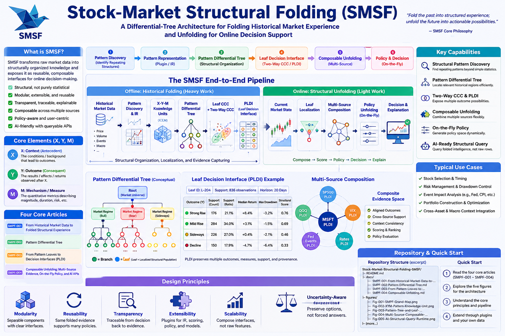
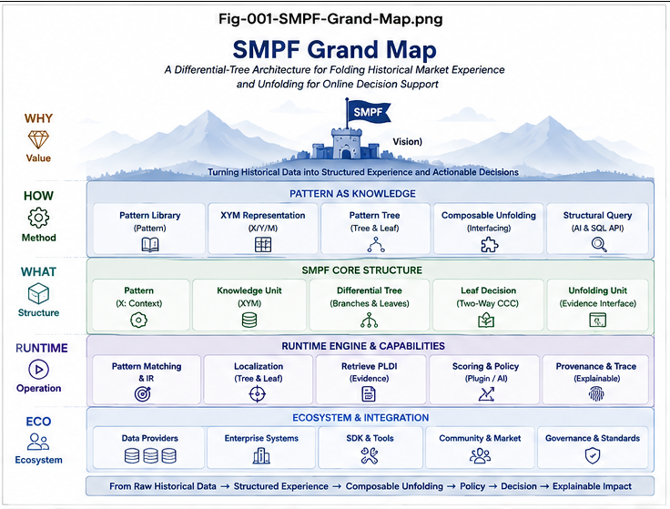

# FIGURE INDEX — Stock-Market Structural Folding (SMSF)

> **Visual map of the five core SMSF figures and the README poster**

---

## 1. Figure Set Overview

The SMSF visual set contains five core figures plus one repository poster.

Together, they follow the same conceptual progression as the four core articles:

\[
\boxed{
Historical\ Folding
\rightarrow
Differential\ Organization
\rightarrow
Decision\ Interface
\rightarrow
Composable\ Unfolding
\rightarrow
AI\ Runtime
}
\]

The recommended visual reading order is:

```text
README Poster
    ↓
Fig-001 — Grand Map
    ↓
Fig-002 — X-Y-M Pattern Knowledge Unit
    ↓
Fig-003 — Pattern Tree + PLDI
    ↓
Fig-004 — Multi-Source Composable Unfolding
    ↓
Fig-005 — AI Structural Query Runtime
````

---

# 2. README Poster

## README-Poster.png

**File**

```text
figures/README-Poster.png
```

**Title**

**Stock-Market Structural Folding (SMSF)**

**Purpose**

The README Poster provides a one-page visual introduction to the entire repository.

It summarizes:

* the motivation;
* offline structural folding;
* online structural unfolding;
* X-Y-M;
* Pattern Differential Tree;
* PLDI;
* multi-source composition;
* policy-aware decisions;
* AI/SQL-style runtime;
* repository reading path.

**Primary use**

* README hero / overview;
* ResearchGate supplementary image;
* presentation overview;
* quick introduction for new readers.

**Recommended placement**

At the beginning of:

```text
README.md
```

immediately after the opening description and core equations.

---

# 3. Fig-001 — SMSF Grand Map

## File

```text
figures/Fig-001-SMSF-Grand-Map.png
```

## Primary Question

> How does SMSF transform historical market data into an online decision runtime?

## Core Content

The figure presents the complete SMSF architecture:

```text
Historical Market Data
        ↓
Pattern Discovery
        ↓
Pattern IR
        ↓
X-Y-M Historical Episodes
        ↓
Pattern Differential Tree
        ↓
Pattern Leaves
        ↓
Two-Way CCC
        ↓
PLDI
════════════════════════════
        ↓
Current Pattern
        ↓
Leaf Localization
        ↓
Relevant PLDIs
        ↓
Multi-Source Composition
        ↓
Scoring
        ↓
Policy Unfolding
        ↓
Decision / Explanation
```

## Main Architectural Message

$$
\boxed{
Heavy\ Fold,\ Light\ Unfold
}
$$

The expensive structural organization is performed offline.

Online runtime work focuses on:

* localization;
* evidence retrieval;
* composition;
* scoring;
* policy;
* explanation.

## Best Paired With

```text
README.md
START-HERE.md
SMSF-001
SMSF-004
```

## Recommended Article Placement

### SMSF-001

Insert after the section introducing the canonical SMSF transformation:

$$
Historical\ Data
\rightarrow
Structural\ Folding
\rightarrow
Decision\ Unfolding
$$

Suggested caption:

> **Fig. 001 — SMSF Grand Map.** Historical market observations are transformed offline into folded structural experience through Pattern Discovery, Pattern IR, X-Y-M episodes, Differential Trees, and Pattern Leaf Decision Interfaces. Online runtime then localizes current patterns, composes relevant evidence, applies scoring and policy, and unfolds decision possibilities.

### SMSF-004

May also be referenced near the final canonical architecture section.

---

# 4. Fig-002 — X-Y-M Pattern Knowledge Unit

## File

```text
figures/Fig-002-XYM-Pattern-Knowledge-Unit.png
```

## Primary Question

> What is the minimal structural unit being folded?

## Core Content

The figure explains:

$$
P_i=(X_i,Y_i,M_i)
$$

where:

### X

Antecedent structure.

Examples:

```text
Price Pattern
Volume Pattern
Trajectory
Context
Events
Market Regime
```

### Y

Subsequent outcome.

Examples:

```text
Strong Rise
Mild Rise
Sideways
Decline
Trajectory Class
```

### M

Quantitative measures.

Examples:

```text
Return
Drawdown
Volatility
Duration
Recovery Time
```

## Main Architectural Message

Historical experience is represented as:

$$
\boxed{
X
\rightarrow
(Y,M)
}
$$

rather than merely:

$$
Timestamp
\rightarrow
Values
$$

The purpose is to preserve antecedent structure and subsequent consequences together.

## Best Paired With

```text
SMSF-001
START-HERE.md
GLOSSARY.md
```

## Recommended Article Placement

### SMSF-001

Insert immediately after the introduction of:

$$
P_k=(X_k,Y_k,M_k)
$$

Suggested caption:

> **Fig. 002 — X-Y-M Pattern Knowledge Unit.** A historical episode is represented by antecedent structure \(X\), subsequent outcome \(Y\), and quantitative measures \(M\). This provides the basic knowledge unit for structural folding.

---

# 5. Fig-003 — Pattern Tree and Leaf Decision Interface

## File

```text
figures/Fig-003-Pattern-Tree-and-Leaf-Decision-Interface.png
```

## Primary Question

> How does structural localization connect to historical outcome evidence?

## Core Content

This figure connects two major SMSF components:

$$
Pattern\ Differential\ Tree
$$

and:

$$
Pattern\ Leaf\ Decision\ Interface
$$

The visual flow is:

```text
Historical X Patterns
        ↓
Pattern Differential Tree
        ↓
Differential Path
        ↓
Pattern Leaf
        ↓
Historical Y/M Population
        ↓
Two-Way CCC
        ↓
PLDI
        ↓
Outcome Branches
```

A PLDI may expose:

```text
Y-Bucket
Structural Score
Support
Measures
Evidence
Provenance
```

## Main Architectural Message

The Pattern Differential Tree answers:

> Where should relevant historical evidence be found?

The PLDI answers:

> What possibilities were historically observed there?

Thus:

$$
\boxed{
X\rightarrow Localization
}
$$

followed by:

$$
\boxed{
Y,M\rightarrow DecisionInterface
}
$$

## Why This Figure Is Important

This is arguably the canonical structural figure of SMSF because it shows the key handshake between:

$$
Offline\ Folding
$$

and:

$$
Online\ Unfolding
$$

at the Pattern Leaf.

## Best Paired With

```text
SMSF-002
SMSF-003
START-HERE.md
```

## Recommended Article Placement

### SMSF-002

Insert after the section defining the Pattern Leaf as the offline/online handshake.

Suggested caption:

> **Fig. 003 — Pattern Differential Tree and Pattern Leaf Decision Interface.** Historical \(X\)-structures are localized through a Differential Tree, while each leaf preserves its associated \(Y/M\) history and exposes that evidence through a PLDI.

### SMSF-003

Insert after the formal definition of:

$$
PLDI=
Pattern\ Leaf\ Decision\ Interface
$$

or after the section introducing Two-Way CCC.

Suggested caption:

> **Fig. 003 — From Pattern Leaf to Decision Interface.** Two-Way CCC organizes the RHS outcome population of a localized Pattern Leaf into multiple decision branches while preserving support, measures, evidence, and provenance.

---

# 6. Fig-004 — Multi-Source Composable Unfolding

## File

```text
figures/Fig-004-Multi-Source-Composable-Unfolding.png
```

## Primary Question

> How can multiple stocks, indexes, events, and contexts participate in one runtime decision without being collapsed into one raw feature vector?

## Core Content

The figure shows independent structural folding for multiple sources.

Example:

```text
MSFT
  ↓
Tree
  ↓
PLDI
     \
SP500 \
  ↓     \
Tree     \
  ↓       \
PLDI ------→ Composite Evidence
           /
VIX       /
  ↓      /
Tree    /
  ↓    /
PLDI  /

Fed Events
  ↓
Tree
  ↓
PLDI
```

The composed evidence then feeds:

```text
Scoring
    ↓
Policy
    ↓
Decision
```

## Main Architectural Message

$$
\boxed{
Scale\ by\ interface\ composition,
not\ by\ raw\text{-}feature\ concatenation.
}
$$

Each source may preserve:

* its own Pattern IR;
* its own Differential Tree;
* its own metric;
* its own local semantics.

Composition occurs through standardized decision-facing interfaces.

## Best Paired With

```text
SMSF-004
README.md
START-HERE.md
```

## Recommended Article Placement

### SMSF-004

Insert after the sections:

* Structural Folding Before Composition;
* PLDI as the Composition Contract;
* Composite Evidence Space.

Suggested caption:

> **Fig. 004 — Multi-Source Composable Unfolding.** Independently folded sources expose PLDIs that can be aligned and composed into a shared Evidence Space before scoring and policy evaluation.

---

# 7. Fig-005 — AI Structural Query Runtime

## File

```text
figures/Fig-005-AI-Structural-Query-Runtime.png
```

## Primary Question

> How can an AI interact with folded market experience as a structured runtime rather than repeatedly reasoning over raw data?

## Core Content

The figure presents:

```text
Human / AI Query
       ↓
Structural Query Interface
       ↓
Pattern Match
       ↓
Leaf Localization
       ↓
PLDI Retrieval
       ↓
Context Comparison
       ↓
Multi-Source Composition
       ↓
Policy Evaluation
       ↓
Decision / Explanation
       ↓
Provenance Trace
```

Possible structural operators include:

```text
PATTERN_MATCH
STRUCTURAL_SIMILARITY
LEAF_LOCALIZE
GET_PLDI
UNFOLD
COMPARE_CONTEXT
MERGE_INTERFACES
POLICY_SCORE
TRACE_PROVENANCE
DETECT_GAP
```

## Main Architectural Message

Traditional query:

$$
Query
\rightarrow
Rows
$$

SMSF-style structural query:

$$
\boxed{
Query
\rightarrow
Folded\ Intelligence
}
$$

AI becomes a runtime client of explicit structural knowledge.

## Best Paired With

```text
SMSF-004
README.md
FUTURE-DIRECTIONS.md
```

## Recommended Article Placement

### SMSF-004

Insert near:

**AI as a Structural Runtime Client**

or:

**Structural Query Interface to Folded Intelligence**

Suggested caption:

> **Fig. 005 — AI Structural Query Runtime.** Human or AI queries can invoke structural operations over Patterns, Leaves, PLDIs, Context, Policy, and Provenance, turning folded historical experience into an interactive decision substrate.

---

# 8. Figure-to-Article Mapping

| Figure                                | SMSF-001 | SMSF-002 | SMSF-003 | SMSF-004 |
| ------------------------------------- | :------: | :------: | :------: | :------: |
| README Poster                         |     ○    |     ○    |     ○    |     ○    |
| Fig-001 — Grand Map                   |   **●**  |     ○    |     ○    |   **●**  |
| Fig-002 — X-Y-M                       |   **●**  |          |          |          |
| Fig-003 — Tree + PLDI                 |          |   **●**  |   **●**  |     ○    |
| Fig-004 — Multi-Source Unfolding      |          |          |     ○    |   **●**  |
| Fig-005 — AI Structural Query Runtime |          |          |          |   **●**  |

Legend:

```text
● = Primary placement
○ = Optional reference
```

---

# 9. Canonical Visual Reading Path

The figures tell one continuous story.

## Fig-002 — What is folded?

$$
(X,Y,M)
$$

↓

## Fig-003 — How is it structurally organized?

$$
X
\rightarrow
DifferentialTree
\rightarrow
Leaf
\rightarrow
PLDI
$$

↓

## Fig-004 — How are multiple folded structures combined?

$$
PLDI_1+\cdots+PLDI_n
\rightarrow
CompositeEvidence
$$

↓

## Fig-005 — How is the resulting structure used?

$$
AI/HumanQuery
\rightarrow
StructuralRuntime
\rightarrow
Decision
$$

Fig-001 wraps all four stages into one Grand Map.

---

# 10. Core Figure Equations

Each figure can be associated with one compact equation.

### Fig-001

$$
\boxed{
History
\xrightarrow{Fold}
StructuralExperience
\xrightarrow{Unfold}
DecisionSpace
}
$$

### Fig-002

$$
\boxed{
P=(X,Y,M)
}
$$

### Fig-003

$$
\boxed{
X\rightarrow Leaf\rightarrow PLDI(Y,M)
}
$$

### Fig-004

$$
\boxed{
PLDI_1+\cdots+PLDI_n
\rightarrow
CompositeEvidence
}
$$

### Fig-005

$$
\boxed{
Query
\rightarrow
FoldedIntelligence
}
$$

---

# 11. Recommended README Figure Order

For the repository README, the recommended visual order is:

```text
README Poster
      ↓
Fig-001 — Grand Map
      ↓
Fig-002 — X-Y-M
      ↓
Fig-003 — Pattern Tree + PLDI
      ↓
Fig-004 — Multi-Source Composition
      ↓
Fig-005 — AI Runtime
```

This gives the reader:

$$
Overview
\rightarrow
KnowledgeUnit
\rightarrow
StructuralCore
\rightarrow
RuntimeComposition
\rightarrow
AIInteraction
$$

---

# 12. Suggested Markdown Embedding

## README Poster

<p align="center">
  
</p>

---

## Fig-001



---

## Fig-002


---

## Fig-003


---

## Fig-004


---

## Fig-005


---

# 13. Figure Caption Set

For consistent publication use, the following compact captions are recommended.

### Fig. 001

**SMSF Grand Map.** The complete architecture from historical market data and Pattern Discovery through Differential Folding and PLDI construction to online localization, evidence composition, policy, and decision unfolding.

### Fig. 002

**X-Y-M Pattern Knowledge Unit.** Historical experience is represented as antecedent structure \(X\), subsequent outcome \(Y\), and quantitative measures \(M\).

### Fig. 003

**Pattern Differential Tree and Leaf Decision Interface.** Structural \(X\)-patterns are localized into leaves whose historical \(Y/M\) populations are organized through Two-Way CCC and exposed as PLDIs.

### Fig. 004

**Multi-Source Composable Unfolding.** Independently folded stocks, indexes, Context, and Events expose compatible decision interfaces that can be composed at runtime without requiring raw-feature concatenation.

### Fig. 005

**AI Structural Query Runtime.** AI and human queries operate through structural APIs over Patterns, Leaves, PLDIs, Context, Policy, and Provenance to access folded historical intelligence.

---

# 14. Visual Design Logic

The figure set follows a deliberate abstraction ladder.

### Fig-002

Smallest knowledge object.

### Fig-003

Core structural organization.

### Fig-004

System-level composition.

### Fig-005

Runtime interaction.

### Fig-001

Unified architecture.

Thus:

$$
KnowledgeUnit
\rightarrow
StructuralMemory
\rightarrow
Composition
\rightarrow
Runtime
$$

with the Grand Map serving as the global reference frame.

---

# 15. Final Visual Map

The complete figure set can be summarized as:

```text
                 Fig-001
              SMSF Grand Map
                    │
       ┌────────────┼────────────┐
       │            │            │
       ▼            ▼            ▼
    Fig-002      Fig-003      Fig-004
     X-Y-M       Tree+PLDI    Composition
       │            │            │
       └────────────┼────────────┘
                    ▼
                 Fig-005
              AI Query Runtime
```

Together, the five figures establish the visual language of **Stock-Market Structural Folding (SMSF)**:

$$
\boxed{
Experience
\rightarrow
Structure
\rightarrow
Interface
\rightarrow
Composition
\rightarrow
Runtime
}
$$
